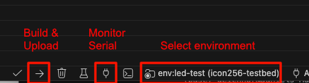

# icon256-testbed

This is a PlatformIO project to test the functionality of a custom 16x16 RGB LED matrix device. The device features:
*   A 16x16 matrix of WS2812B RGB LEDs (256 total).
*   A MAX98357A I2S audio amplifier and loudspeaker.
*   An ICS-43434 I2S MEMS microphone.
*   An ESP32-S3 microcontroller.

## Build Environment Setup (VS Code + PlatformIO)

### 1) Install prerequisites
*   Install [Visual Studio Code](https://code.visualstudio.com/).
*   Install the VS Code extension **PlatformIO IDE**.
*   Ensure your board USB driver is available on your OS (for ESP32-S3 serial upload/monitor).

### 2) Open this project in VS Code
*   Clone or download this repository.
*   In VS Code, use **File -> Open Folder...** and open the project root (the folder containing `platformio.ini`).
*   Wait for PlatformIO to finish indexing/installing dependencies on first open.

### 3) Understand `platformio.ini`
*   This project defines multiple environments under sections like `[env:rgb-led]`, `[env:buttons]`, `[env:led-test]`.
*   The key line is:

```ini
build_src_filter = +<*.h> +<main-${PIOENV}.cpp>
```

*   That means the active environment name selects the matching source file:
	*   `-e rgb-led` builds `src/main-rgb-led.cpp`
	*   `-e led-test` builds `src/main-led-test.cpp`
	*   `-e buttons` builds `src/main-buttons.cpp`

### 4) Build, upload, and monitor
Use the integrated terminal in VS Code:

```sh
# Build one environment
pio run -e led-test

# Upload firmware
pio run -e led-test -t upload

# Open serial monitor
pio device monitor -b 115200
```

You can replace `led-test` with any environment listed in `platformio.ini`.

### 5) Typical workflow in VS Code
1. Select which environment you want to run.
2. Build (`pio run -e <env>`).
3. Upload (`pio run -e <env> -t upload`).
4. Monitor logs (`pio device monitor -b 115200`).

The screenshot below shows environment selection and the PlatformIO actions for build/upload and monitor in VS Code:



If upload fails, check cable quality, USB port selection, and whether another serial monitor is already connected.

## Test Environments

This project contains several test environments, each in a separate `src/main-<env-name>.cpp` file. You can build and upload a specific test using the PlatformIO CLI.

For example, to run the `rgb-led` test:
```sh
pio run -e rgb-led --target upload
```

---

### `rgb-led`
*   **File**: `src/main-rgb-led.cpp`
*   **Description**: A basic test for the 16x16 RGB LED matrix. It cycles the entire matrix through solid red, green, and blue, and then runs a single white pixel across all 256 LEDs to verify functionality and addressing.

### `led-test`
*   **File**: `src/main-led-test.cpp`
*   **Description**: Interactive LED/button test for the 16x16 matrix.
	*   On startup, all LEDs are set to white.
	*   BTN1 (GPIO 11) cycles all LEDs through red, green, blue, and white, then repeats.
	*   BTN1 also resets the single-pixel mode index to `0`.
	*   BTN2 (GPIO 12) enables single-pixel mode: all other LEDs are turned off, one white pixel is shown, and the active pixel advances by one on each press (with wraparound).
	*   BTN3 (GPIO 13) is currently unused in this test.

### `i2s-sound-out`
*   **File**: `src/main-i2s-sound-out.cpp`
*   **Description**: Tests the MAX98357A I2S amplifier and speaker by generating and playing a continuous 440Hz sine wave (A4 note).

### `i2s-mic-test`
*   **File**: `src/main-i2s-mic-test.cpp`
*   **Description**: Verifies the ICS-43434 I2S microphone. It reads audio samples and prints the calculated RMS (Root Mean Square) volume level to the serial monitor.

### `mic-visualizer`
*   **File**: `src/main-mic-visualizer.cpp`
*   **Description**: A 16-band audio spectrum visualizer. It uses the I2S microphone to capture audio, performs an FFT to analyze frequencies, and displays the result as animated bars on the 16x16 LED matrix.

### `mic-webstream`
*   **File**: `src/main-mic-webstream.cpp`
*   **Description**: Streams live audio from the I2S microphone over a local web server. After connecting to WiFi, you can open the device's IP address in a web browser to listen to the microphone in real-time. Includes a serial prompt to configure WiFi credentials.

### `i2s-internet-radio`
*   **File**: `src/main-i2s-internet-radio.cpp`
*   **Description**: Connects to WiFi and streams an internet radio station, playing the audio through the I2S speaker. It features a command-line prompt via the serial monitor to enter and save WiFi credentials to persistent storage.

### `tts-time`
*   **File**: `src/main-tts-time.cpp`
*   **Description**: A talking clock that uses Google's Text-to-Speech service. It connects to WiFi, synchronizes time via NTP, and announces the current time through the speaker at the top of every minute. It also uses the command-line prompt for WiFi setup.

### `ntp-clock`
*   **File**: `src/main-ntp-clock.cpp`
*   **Description**: A graphical clock for the 16x16 LED matrix. It gets the time via NTP and features multiple display modes (large digital, compact digital, and analog) that can be cycled by pressing the BOOT button (GPIO 0).

## WiFi Credential Setup

Several of the network-enabled examples (`mic-webstream`, `i2s-internet-radio`, `tts-time`, `ntp-clock`) use a common WiFi credential manager.

1.  The first time you run one of these examples, open the Serial Monitor.
2.  You will be prompted to enter your WiFi SSID and password.
3.  The credentials will be saved to the device's non-volatile storage.
4.  The device will restart and automatically connect on subsequent boots.

If the device cannot connect to the saved network, it will automatically re-enter the setup prompt.